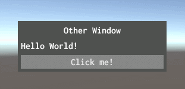
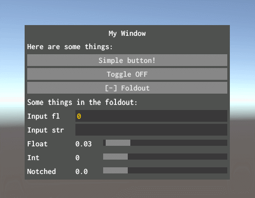
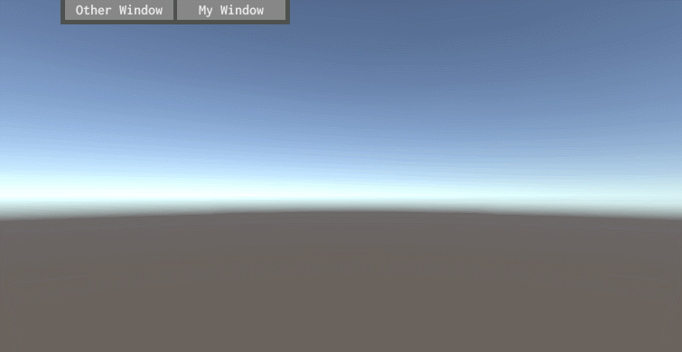

# ProtoGUI
Simple, quick and good looking GUI windows for Unity, intended for prototyping and debugging. The package includes Inconsolata open source font by Raph Levien.

Warning: It is basically a wrapper for Unity's IMGUI, so it is not very performant and GC friendly! The goal of it however is ease of use and is not recommended for production (although I am using it in [TBICCT](https://nothke.itch.io/tower))

If you want something like this but more performant, you'll have to wait until Unity's UIElements become available for runtime.

### Installation
Use it as a Unity package, so don't put it in your assets folder, instead either put it in the Packages folder, or some other common folder (to which you can reference from different projects). Then and add it using the Package Manager "+" icon > "Add package from disk..".

### How To Use

All you need to do is just inherit from WindowGUI, and then implement the required methods (ctrl + . in VS or Rider). Set the window title, and you can simply start using your window with GUILayout:

```
using Nothke.ProtoGUI;

public class MyWindow : WindowGUI
{
    public override string WindowLabel => "My cute window!";

    protected override void Window()
    {
        GUILayout.Label("Hello World!");
        GUILayout.Button("Click me!");
    }
}
```

Put the script on any object in the scene and you should see this:



..It's also draggable ;)

### A few more useful methods

There are a few more useful methods that you can use to make things easy:

```
using Nothke.ProtoGUI;

public class WindowExample : WindowGUI
{
    public override string WindowLabel => "My Window";

    bool toggleOn;
    float floatInput = 0;
    string stringInput = "";
    float slider1Value;
    int slider2Value;
    float slider3Value;
    bool showFoldout;

    private void Start()
    {
        // Optional values you can override
        windowRect.width = 400; // Sets initial window width
        labelWidth = 90; // Sets label width of a Slider()
        sliderNumberWidth = 50; // Sets width of the number in a Slider()
        draggable = true;
    }

    protected override void Window()
    {
        Label("Here are some things:");
        Button("Simple button!");

        ToggleButton("Toggle", ref toggleOn);

        Foldout("Foldout", ref showFoldout);

        if (showFoldout)
        {
            Label("Some things in the foldout:");

            // Inputs
            floatInput = FloatField("Input fl", floatInput);
            LabelField("Input str", ref stringInput);
        }

        // Float and int sliders:
        slider1Value = Slider("Float", slider1Value, 0.0f, 1.0f, "F2");
        slider2Value = Slider("Int", slider2Value, 0, 100);

        // A "notched" float slider that will step by stepSize
        slider3Value = Slider("Notched", slider3Value, 0, 2, 0.2f);
    }
}
```

The result:



### The Toolbar

Additionally, you can use a toolbar, which can automatically detect all active windows and display them in a toggleable strip. Just add the ToolbarGUI script to any object and it will be rendered on top edge of the screen.



### Detecting if mouse over the UI

You can use GameWindow.IsMouseOverUI() to detect if the mouse is currently over any of the windows. This is useful for preventing the mouse "clicking through" the UI or disabling keyboard input, for example.

### Toggle all GUI with a key

Another utility is the GUIToggler, with which you can toggle the entire GUI (default is \`). Just add the GUIToggler script to any GameObject.